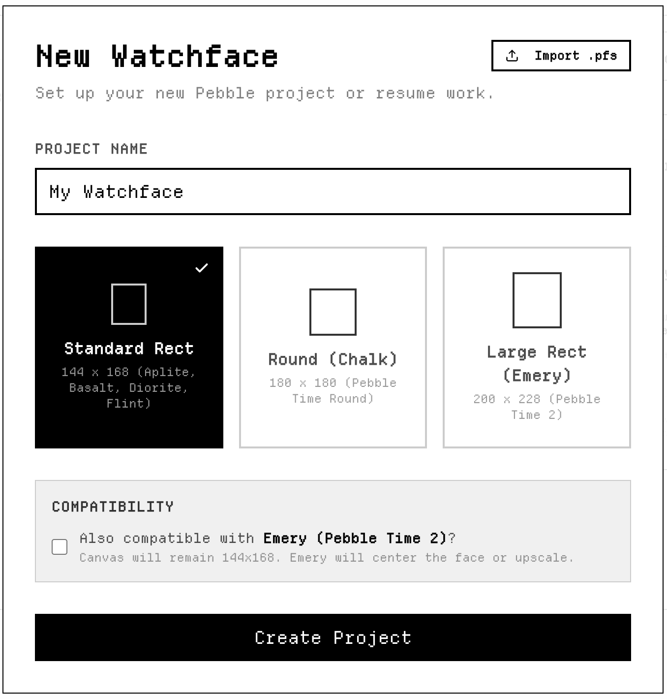
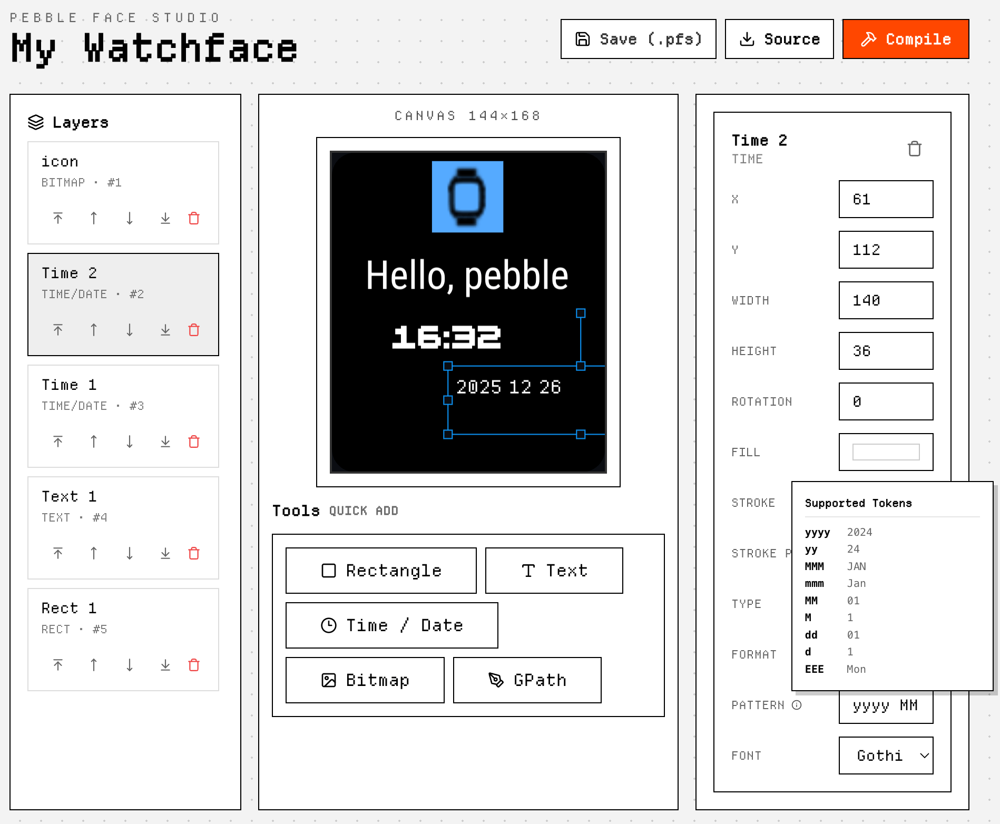

# Pebble Face Studio

A visual, modern watchface editor for the Pebble smartwatch ecosystem. Design your watchfaces in the browser and get the PBW file ready to install on your watch with just one click. Try the web version [here](https://studio.pebbleface.com/).


## Features

- **Visual Canvas Editor**: Drag, drop, scale, and rotate elements on a pixel-perfect canvas.
- **Multiple Element Types**:
  - **Rectangles**: Backgrounds, accents, and shapes.
  - **Text**: Static text with custom or system fonts.
  - **Time/Date**: Dynamic time elements with multiple formatting options.
  - **Bitmaps**: Use your favorite PNG images as background.
  - **GPaths**: Draw custom vector paths.
- **Pebble System Fonts**: Full support for standard Pebble fonts including Raster Gothic, Bitham, Roboto, and LECO 1976.
- **Custom Font Support**: Upload your own `.ttf` or `.otf` files to use in your design.
- **Monochrome Preview**: Toggle black & white preview to see how your design looks on monochrome Pebble watches.
- **Project Management**: Save and continue your work with the `.pfs` (Pebble Face Studio) file.
- **Build & Export**: Obtain the installable `.pbw` or download a `.zip` bundle ready for the Pebble SDK.


## Getting Started

### Prerequisites

- [Node.js](https://nodejs.org/) (v18 or higher)
- [pnpm](https://pnpm.io/) (recommended) or npm/yarn

### Installation

1. Clone the repository:
   ```bash
   git clone https://github.com/Yorks0n/pebble-face-studio.git
   cd pebble-face-studio
   ```

2. Install dependencies:
   ```bash
   pnpm install
   ```

3. Start the development server:
   ```bash
   pnpm dev
   ```

4. Open your browser to `http://localhost:5173`.

### Building for Production

To create an optimized production build:
```bash
pnpm build
```

## How to Use

**New Project**: Enter the project name and select the appropriate resolution. Standard Rect (144 × 168) is suitable for all the old pebbles except Pebble Time Round. For Time Round please select Round (180 × 180). If you want to design a watchface for the upcoming Pebble Time 2 at its native resolution, choose Large Rect. 

If you have a previously generated `.pfs`, you can click on the button at the top right to import it.

> Note: The compatibility here currently only affects whether installation is possible on the corresponding models and does not involve auto-scaling. 



**Design**: Use the toolbar at the bottom to quickly add elements. Use the left-hand layers panel to adjust the layer order and change the overlapping relationships. Select the element and use the properties panel on the right to tweak coordinates, colors, and font settings. You can now customize the format for time and date by selecting **Format** - **Custom** and adjusting the **Pattern** string.

> Note 1: The built-in font preview currently uses free/open-source fonts that look similar to Pebble system fonts, so the preview may differ from the real watchface. Please refer to actual Pebble system font styles at [system-fonts](https://developer.repebble.com/guides/app-resources/system-fonts/).
>
> Note 2: Using Rotate on low-resolution screens may result in poor performance or not work at all. I plan to remove this in the future.



**Save Progress**: Click **"Save (.pfs)"** to download a local backup of your project. You can resume later by using the "Import" button in the New Project window.

**Export**: Once satisfied, click **"Compile"** and wait a few seconds to get the PBW files available for installation. Or your can click **"Source"** to get the Pebble SDK source code for further edit. Please refer to [Use the Pebble SDK in the Cloud](https://developer.repebble.com/sdk/cloud) for using the cloud development environment.

## License

This project is licensed under the **MIT License**. See the [LICENSE](LICENSE) file for details.

## Acknowledgments

- Built for the Pebble enthusiast community.
- Custom fonts provided in `@fonts/` are for preview purposes and subject to their respective licenses.